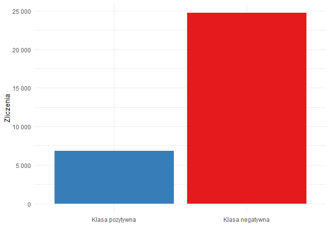

Credit risk rating and scoring
================
Wiktor Piela

## Dane

Źródłem danych jest kaggle.com -
<https://www.kaggle.com/datasets/laotse/credit-risk-dataset>. W zbiorze
są dostępne następujące cechy klientów:

-   wiek
-   roczny przychód
-   forma własności domu
-   jak długo klient jest zatrudniony (w latach)
-   cel kredytu
-   grade kredytowy przypisany na podstawie historycznych danych
-   kwota kredytu oraz oprocentowanie
-   informacja, czy były opóźnienia w spłacie (zmienna zależna, która
    będzie modelowana)
-   jaki odsetek rocznego przychodu stanowi kwota kredytu
-   czy w przeszłości zaistniały opóźnienia w spłacie rat
-   długość historii kredytowej (w latach)

Liczba obserwacji równa jest 31 522, z czego, dla zmiennej
oprocentowanie kredytu, w 3 027\` obserwacjach wystepują braki danych.

Poniżej pierwsze pięć obserwacji zbioru:

<table class=" lightable-material lightable-striped lightable-hover" style="font-family: &quot;Source Sans Pro&quot;, helvetica, sans-serif; margin-left: auto; margin-right: auto;">
<thead>
<tr>
<th style="text-align:right;background-color: cadetblue !important;">
person_age
</th>
<th style="text-align:right;background-color: cadetblue !important;">
person_income
</th>
<th style="text-align:left;background-color: cadetblue !important;">
person_home_ownership
</th>
<th style="text-align:right;background-color: cadetblue !important;">
person_emp_length
</th>
<th style="text-align:left;background-color: cadetblue !important;">
loan_intent
</th>
<th style="text-align:left;background-color: cadetblue !important;">
loan_grade
</th>
<th style="text-align:right;background-color: cadetblue !important;">
loan_amnt
</th>
<th style="text-align:right;background-color: cadetblue !important;">
loan_int_rate
</th>
<th style="text-align:left;background-color: cadetblue !important;">
loan_status
</th>
<th style="text-align:right;background-color: cadetblue !important;">
loan_percent_income
</th>
<th style="text-align:left;background-color: cadetblue !important;">
cb_person_default_on_file
</th>
<th style="text-align:right;background-color: cadetblue !important;">
cb_person_cred_hist_length
</th>
</tr>
</thead>
<tbody>
<tr>
<td style="text-align:right;">
21
</td>
<td style="text-align:right;">
9600
</td>
<td style="text-align:left;">
OWN
</td>
<td style="text-align:right;">
5
</td>
<td style="text-align:left;">
EDUCATION
</td>
<td style="text-align:left;">
B
</td>
<td style="text-align:right;">
1000
</td>
<td style="text-align:right;">
11.14
</td>
<td style="text-align:left;">
0
</td>
<td style="text-align:right;">
0.1041667
</td>
<td style="text-align:left;">
0
</td>
<td style="text-align:right;">
2
</td>
</tr>
<tr>
<td style="text-align:right;">
25
</td>
<td style="text-align:right;">
9600
</td>
<td style="text-align:left;">
MORTGAGE
</td>
<td style="text-align:right;">
1
</td>
<td style="text-align:left;">
MEDICAL
</td>
<td style="text-align:left;">
C
</td>
<td style="text-align:right;">
5500
</td>
<td style="text-align:right;">
12.87
</td>
<td style="text-align:left;">
1
</td>
<td style="text-align:right;">
0.5729167
</td>
<td style="text-align:left;">
0
</td>
<td style="text-align:right;">
3
</td>
</tr>
<tr>
<td style="text-align:right;">
23
</td>
<td style="text-align:right;">
65500
</td>
<td style="text-align:left;">
RENT
</td>
<td style="text-align:right;">
4
</td>
<td style="text-align:left;">
MEDICAL
</td>
<td style="text-align:left;">
C
</td>
<td style="text-align:right;">
35000
</td>
<td style="text-align:right;">
15.23
</td>
<td style="text-align:left;">
1
</td>
<td style="text-align:right;">
0.5343511
</td>
<td style="text-align:left;">
0
</td>
<td style="text-align:right;">
2
</td>
</tr>
<tr>
<td style="text-align:right;">
24
</td>
<td style="text-align:right;">
54400
</td>
<td style="text-align:left;">
RENT
</td>
<td style="text-align:right;">
8
</td>
<td style="text-align:left;">
MEDICAL
</td>
<td style="text-align:left;">
C
</td>
<td style="text-align:right;">
35000
</td>
<td style="text-align:right;">
14.27
</td>
<td style="text-align:left;">
1
</td>
<td style="text-align:right;">
0.6433824
</td>
<td style="text-align:left;">
1
</td>
<td style="text-align:right;">
4
</td>
</tr>
<tr>
<td style="text-align:right;">
21
</td>
<td style="text-align:right;">
9900
</td>
<td style="text-align:left;">
OWN
</td>
<td style="text-align:right;">
2
</td>
<td style="text-align:left;">
VENTURE
</td>
<td style="text-align:left;">
A
</td>
<td style="text-align:right;">
2500
</td>
<td style="text-align:right;">
7.14
</td>
<td style="text-align:left;">
1
</td>
<td style="text-align:right;">
0.2525253
</td>
<td style="text-align:left;">
0
</td>
<td style="text-align:right;">
2
</td>
</tr>
<tr>
<td style="text-align:right;">
26
</td>
<td style="text-align:right;">
77100
</td>
<td style="text-align:left;">
RENT
</td>
<td style="text-align:right;">
8
</td>
<td style="text-align:left;">
EDUCATION
</td>
<td style="text-align:left;">
B
</td>
<td style="text-align:right;">
35000
</td>
<td style="text-align:right;">
12.42
</td>
<td style="text-align:left;">
1
</td>
<td style="text-align:right;">
0.4539559
</td>
<td style="text-align:left;">
0
</td>
<td style="text-align:right;">
3
</td>
</tr>
</tbody>
</table>

## Cel analizy

Należy przede wszystkim zbadać, jakie zależności prezentują dane.
Następnie przeprowadzone zostanie modelowanie statystycznie przy użyciu
kilku metod uczenia maszynowego w celu oceny ryzyka kredytowego - tzn.
sklasyfikowania klienta, czy na podstawie wykazywanych przez siebie
cech, wystąpią opóźnienia w spłacie kredytu. Ten model, który uzyska
najlepszą efektywność zostanie ostatecznie wybrany.

*Dane oraz sytuacja mają charakter bardzo uproszczony - celem jest
jedynie przeprowadzenie oceny ryzyka kredytowego za pomocą poznanych
metod statystycznego uczenia maszynowego oraz prezentacja użytych w tym
celu narzędzi. Dane wygenerowane automatycznie.*

## Eksploracja

Po pierwsze, eksplorując zbiór danych możemy z łatwością dostrzec dość
intuicyjne zależności -

-   osoby z starsze mają dłuższą historię kredytową

<!-- -->

-   oprocentowanie kredytu zależne jest od przyznanego greade’u
    kredytowego - klienci bardziej godni zaufania mają przyznawane
    średnio tańsze kredyty

<!-- -->

-   klienci z wyższą wartością stosunku kwoty zaciągniętego kredytu do
    sumy rocznego przychodu danego mają większe problemy z jego spłatą

<!-- -->

-   klienci z mniejszym rocznym przychodem zaciągali średnio kredyty
    mniejszej wartości (co niewątpliwie wynika wprost z ich zdolności
    kredytowej), dodatkowo - ponownie widać, że klienci opóźniający się
    ze spłatą kredytów to ci zarabiający ogólnie mniej niż spłacający w
    terminie

<!-- -->

Co ciekawe, jeśli zestawimy ze sobą informacje o tym, czy w przeszłości
klient spóźniał się ze wpłatą raty wraz z tym, czy miało to miejsce przy
kredycie w badanym zbiorze, zauważymy poniższą zależność.

    ##    Cell Contents 
    ## |-------------------------|
    ## |                   Count | 
    ## |             Row Percent | 
    ## |-------------------------|
    ## 
    ## =========================================================
    ##                                     credit$loan_status
    ## credit$cb_person_default_on_file        1       0   Total
    ## ---------------------------------------------------------
    ## 0                                   4695   21213   25908 
    ##                                     18.1%   81.9%   82.2%
    ## ---------------------------------------------------------
    ## 1                                   2112    3502    5614 
    ##                                     37.6%   62.4%   17.8%
    ## ---------------------------------------------------------
    ## Total                               6807   24715   31522 
    ## =========================================================

Wśród wszystkich osób, które wcześniej miały problemy ze spłatą,
sytuacja powtórzyła się u ponad 37% klientów

## Modelowanie

Pierwszym krokiem będzie podział zbiorów na treningowy oraz testowy w
proporcji 80/20, dbając jednocześnie o to, aby w każdym z nich była
odpowiednia reprezentacja zmiennej zależnej.

``` r
set.seed(123)
credit_split <- initial_split(credit, prop = 0.8, strata = loan_status)
credit_train <- training(credit_split)
credit_test <- testing(credit_split)
```

Ponadto, aby nie dodawać do zbiorów danych predykcji każdego modelu,
stworzone zostaną dwie dodatkowe ramki danych (dla estymacji na zbiorze
testowym i treningowym), gdzie będą przechowywane te predykcje w formie
prawdopodobieństwa przynależności klienta do danej klasy. Na początku
dodane zostaną tam rzeczywiste etykiety klientów. Dodatkowo,
zdefiniowana zostanie funkcja ułatwiająca dodawanie kolejnych predykcji.

``` r
model_train_performance <- tibble(
  actual = credit_train$loan_status
  )

model_test_performance <- tibble(
  actual = credit_test$loan_status
)

add_predictions <- function(main_df,model,data,name_1,name_0){
  
  preds <- predict(model, data, type = "prob") %>% 
    set_names(c(name_1,name_0))
  
  main_df <- add_column(main_df, preds)
  
  return(main_df)
}
```

Jeszcze zanim przejdziemy do trenowania modeli, niezbędne będzie
stworzenie recepty. Niezależnie od wykorzystanej potem metody, zmienną
objaśnianą zawsze będzie przynależność klienta do danej klasy - 0 brak
opóźnień w spłacie rat lub 1 - opóźnienia. Jako predyktory do
sklasyfikowania etykiety klienta zostaną wykorzystane wszystkie inne
zmienne. Z uwagi na występujące w zbiorze braki danych dla zmiennej -
oprocentowanie kredytu, do recepty dodajemy imputację braków danych -
tworząc do tego celu pomocniczy model lasu losowego.

``` r
credit_recipe <- recipe(loan_status~.,credit_train) %>% 
  step_impute_bag(loan_int_rate)
```

## Kryteria oceny modelu

Typowo odpowiedzią wykorzystanych poniżej klasyfikatorów jest
prawdopodobieństwo przynależności danej obserwacji do klasy pozytywnej
(opóźnienie w spłacie kredytu). W celu przypisania estymacji ostatecznie
danej klasy i obliczenia takich metryk jak czułość, swoistość czy
precyzja, niezbędne jest ustalenie thresholdu, którego poziom zawsze
jest specyficzny dla danego problemu i ustalany indywidualnie zgodnie z
widzą dziedzinową. Istnieje jednak miara skuteczności modelu, którą
można wyrazić bez ustalania konkretnej wartości progu - pole od krzywą
ROC. Referencyjnie - AUC dla idealnego modelu będzie miało wartość równą
1, a dla losowego 0.5.

Dodatkowo, z uwagi na brak zbalansowania liczebności klas w zbiorze
danych, rozpatrywanie accuracy jako potencjalnej metryki oceny modelu
nie jest dobrym pomysłem.

<!-- -->

### Regresja logistyczna

Pierwszą wykorzystaną metodą będzie klasyfikator liniowy dokonujący
binarnej klasyfikacji korzystając z funkcji logistycznej, której
odpowiedzią jest prawdopodobieństwo przynależności obserwacji do danej
klasy. Jednak z uwagi na nieliniowy charakter prawdopodobieństwa
regresja logistyczna modeluje logarytm szans przynależności obserwacji
do klasy 0 lub 1, które następnie mapowane są na prawdopodobieństwa
(wartości z przedziału od 0 do 1).

Poniżej tworzymy model trenowany na zbiorze treningowym, następnie przy
pomocy zdefiniowanej wcześniej funkcji dodajemy predykcje modelu zarówno
na zbiorze testowym jak i treningowym.

``` r
glm_model <- logistic_reg()

glm_wflow <- workflow() %>%
  add_model(glm_model) %>% 
  add_recipe(credit_recipe)

glm_fit <- glm_wflow %>% 
  fit(credit_train)


model_train_performance <- add_predictions(model_train_performance,
                                           glm_fit,
                                           credit_train,
                                           "glm_pred_1",
                                           "glm_pred_0")

model_test_performance <- add_predictions(model_test_performance,
                                          glm_fit,
                                          credit_test,
                                          "glm_pred_1",
                                          "glm_pred_0")
```

### Naiwny klasyfikator bayesowski

Prawdopodobieństwa zwracane przez ten klasyfikator szacowane są na
podstawie empirycznej częstości występowania cech obserwacji. Zakłada on
ponadto ich niezależność (naiwność).

``` r
bayes_model <- naive_Bayes()

bayes_wflow <- workflow() %>%
  add_model(bayes_model) %>% 
  add_recipe(credit_recipe)

bayes_fit <- bayes_wflow %>% 
  fit(credit_train)

xx <- predict(bayes_fit, credit_train, type="prob")

model_train_performance <- add_predictions(model_train_performance,
                                           bayes_fit,
                                           credit_train,
                                           "bayes_pred_1",
                                           "bayes_pred_0")

model_test_performance <- add_predictions(model_test_performance,
                                          bayes_fit,
                                          credit_test,
                                          "bayes_pred_1",
                                          "bayes_pred_0")
```

### KNN

Klasyfikator k najbliższych sąsiadów bierze pod uwagę obserwacje
znajdujące się najbliżej (odległość euklidesowa) klasyfikowanej
obserwacji. Zwraca zatem prawdopodobieństwo - jeżeli 5 najbliższych
sąsiadów trzech należy do klasy 0, a dwóch pozostałych do klasy 1, to
istnieje prawdopodobieństwo równe 60%, że klasyfikowana obserwacja to
klasa 0, a 40%, że należy jej przypisać etykietę 1.

Proces modelowania knn będzie różnił się od wcześniejszych:

-   po pierwsze - z uwagi na konieczność znormalizowania wszystkich
    zmiennych numerycznych, niezbędna jest aktualizacja zdefiniowanej
    wcześniej recepty

-   po drugie - predykcje modelu będą ściśle zależne od tego, jaka
    wartość k zostanie wybrana. Zatem w trakcie 5 - krotnej walidacji
    krzyżowej wartość hiperparametru k będzie tuningowana i finalnie
    zostanie wybrana taka, która daje najlepsze rezultaty estymacji
    (największa wartość pola pod krzywą ROC - AUC). Na początku zostanie
    sprawdzone 10 wartości k zdefiniowanych w pakiecie tidymodels
    domyślnie.

``` r
knn_model <- nearest_neighbor(neighbors = tune()) %>%
  set_engine("kknn") %>%
  set_mode("classification")

knn_recipe <- credit_recipe %>%
  step_normalize(all_numeric_predictors())

knn_wflow <- workflow() %>%
  add_model(knn_model) %>%
  add_recipe(knn_recipe)

knn_tune <- knn_wflow %>% tune_grid(
  resamples = vfold_cv(credit_train, v=5, strata=loan_status),
  grid = 10,
  metrics = metric_set(roc_auc),
  control = control_grid(verbose = TRUE)
  )
```

Wraz ze wzrostem k, AUC zwiększa się. Oznacza to, że można spróbować
sprawdzić większą wartość k, ponieważ im większa wartość tego
hiperparametru, tym mniej skomplikowany jest model.

<table class=" lightable-material lightable-striped lightable-hover" style="font-family: &quot;Source Sans Pro&quot;, helvetica, sans-serif; margin-left: auto; margin-right: auto;">
<thead>
<tr>
<th style="text-align:right;background-color: cadetblue !important;">
neighbors
</th>
<th style="text-align:left;background-color: cadetblue !important;">
.metric
</th>
<th style="text-align:left;background-color: cadetblue !important;">
.estimator
</th>
<th style="text-align:right;background-color: cadetblue !important;">
mean
</th>
<th style="text-align:right;background-color: cadetblue !important;">
n
</th>
<th style="text-align:right;background-color: cadetblue !important;">
std_err
</th>
<th style="text-align:left;background-color: cadetblue !important;">
.config
</th>
</tr>
</thead>
<tbody>
<tr>
<td style="text-align:right;">
14
</td>
<td style="text-align:left;">
roc_auc
</td>
<td style="text-align:left;">
binary
</td>
<td style="text-align:right;">
0.8856970
</td>
<td style="text-align:right;">
5
</td>
<td style="text-align:right;">
0.0025804
</td>
<td style="text-align:left;">
Preprocessor1_Model9
</td>
</tr>
<tr>
<td style="text-align:right;">
13
</td>
<td style="text-align:left;">
roc_auc
</td>
<td style="text-align:left;">
binary
</td>
<td style="text-align:right;">
0.8848491
</td>
<td style="text-align:right;">
5
</td>
<td style="text-align:right;">
0.0024950
</td>
<td style="text-align:left;">
Preprocessor1_Model8
</td>
</tr>
<tr>
<td style="text-align:right;">
12
</td>
<td style="text-align:left;">
roc_auc
</td>
<td style="text-align:left;">
binary
</td>
<td style="text-align:right;">
0.8833542
</td>
<td style="text-align:right;">
5
</td>
<td style="text-align:right;">
0.0023244
</td>
<td style="text-align:left;">
Preprocessor1_Model7
</td>
</tr>
<tr>
<td style="text-align:right;">
11
</td>
<td style="text-align:left;">
roc_auc
</td>
<td style="text-align:left;">
binary
</td>
<td style="text-align:right;">
0.8818916
</td>
<td style="text-align:right;">
5
</td>
<td style="text-align:right;">
0.0023073
</td>
<td style="text-align:left;">
Preprocessor1_Model6
</td>
</tr>
<tr>
<td style="text-align:right;">
9
</td>
<td style="text-align:left;">
roc_auc
</td>
<td style="text-align:left;">
binary
</td>
<td style="text-align:right;">
0.8779729
</td>
<td style="text-align:right;">
5
</td>
<td style="text-align:right;">
0.0024243
</td>
<td style="text-align:left;">
Preprocessor1_Model5
</td>
</tr>
</tbody>
</table>

<!-- -->

Sprawdźmy, dla jakiej wartości k, AUC zaczyna spadać - innymi słowy
jakie k najlepiej wybrać, aby - model był mniej skomplikowany, a przy
czym pole pod krzywą ROC było jak największe.

``` r
knn_tune <- knn_wflow %>% tune_grid(
  resamples = vfold_cv(credit_train, v=5, strata=loan_status),
  grid = data.frame(neighbors = seq(10,250,5)),
  metrics = metric_set(roc_auc),
  control = control_grid(verbose = TRUE)
 )
```

Ostatecznie widać, że wartość hiperparamteru około 70 wydaje się mieć
najlepszą efektywność, dlatego taka tez wartość zostanie wybrana.

<table class=" lightable-material lightable-striped lightable-hover" style="font-family: &quot;Source Sans Pro&quot;, helvetica, sans-serif; margin-left: auto; margin-right: auto;">
<thead>
<tr>
<th style="text-align:right;background-color: cadetblue !important;">
neighbors
</th>
<th style="text-align:left;background-color: cadetblue !important;">
.metric
</th>
<th style="text-align:left;background-color: cadetblue !important;">
.estimator
</th>
<th style="text-align:right;background-color: cadetblue !important;">
mean
</th>
<th style="text-align:right;background-color: cadetblue !important;">
n
</th>
<th style="text-align:right;background-color: cadetblue !important;">
std_err
</th>
<th style="text-align:left;background-color: cadetblue !important;">
.config
</th>
</tr>
</thead>
<tbody>
<tr>
<td style="text-align:right;">
70
</td>
<td style="text-align:left;">
roc_auc
</td>
<td style="text-align:left;">
binary
</td>
<td style="text-align:right;">
0.8949159
</td>
<td style="text-align:right;">
5
</td>
<td style="text-align:right;">
0.0007864
</td>
<td style="text-align:left;">
Preprocessor1_Model13
</td>
</tr>
<tr>
<td style="text-align:right;">
75
</td>
<td style="text-align:left;">
roc_auc
</td>
<td style="text-align:left;">
binary
</td>
<td style="text-align:right;">
0.8948851
</td>
<td style="text-align:right;">
5
</td>
<td style="text-align:right;">
0.0007139
</td>
<td style="text-align:left;">
Preprocessor1_Model14
</td>
</tr>
<tr>
<td style="text-align:right;">
65
</td>
<td style="text-align:left;">
roc_auc
</td>
<td style="text-align:left;">
binary
</td>
<td style="text-align:right;">
0.8948655
</td>
<td style="text-align:right;">
5
</td>
<td style="text-align:right;">
0.0008471
</td>
<td style="text-align:left;">
Preprocessor1_Model12
</td>
</tr>
<tr>
<td style="text-align:right;">
80
</td>
<td style="text-align:left;">
roc_auc
</td>
<td style="text-align:left;">
binary
</td>
<td style="text-align:right;">
0.8948203
</td>
<td style="text-align:right;">
5
</td>
<td style="text-align:right;">
0.0006638
</td>
<td style="text-align:left;">
Preprocessor1_Model15
</td>
</tr>
<tr>
<td style="text-align:right;">
60
</td>
<td style="text-align:left;">
roc_auc
</td>
<td style="text-align:left;">
binary
</td>
<td style="text-align:right;">
0.8947930
</td>
<td style="text-align:right;">
5
</td>
<td style="text-align:right;">
0.0009435
</td>
<td style="text-align:left;">
Preprocessor1_Model11
</td>
</tr>
</tbody>
</table>

<!-- -->

Finalny model knn został wytrenowany dla k=70, a jego estymacje dodane.

``` r
params <- select_best(knn_tune, metric = "roc_auc")

knn_fit <- knn_wflow %>%
  finalize_workflow(params) %>%
  fit(credit_train)


model_train_performance <- add_predictions(model_train_performance,
                                           knn_fit,
                                           credit_train,
                                           "knn_pred_1",
                                           "knn_pred_0")

model_test_performance <- add_predictions(model_test_performance,
                                          knn_fit,
                                          credit_test,
                                          "knn_pred_1",
                                          "knn_pred_0")
```

### Drzewo decyzyjne

Klasyfikator drzewa decyzyjnego dokonuje podziału przestrzeni
n-wymiarowej predyktorów w taki sposób, aby po podziale:

-   zminimalizować procentową liczbę błędów lub

-   zminimalizować index Giniego / entropię

Gdy algorytm skończy pracę (dokonanie kolejnego podziału nie polepszy
modelu) zwracane jest prawdopodobieństwo przynależności klasyfikowanej
obserwacji w obszarze podziału. Istnieje wiele hiperparametrów dla
drzewa decyzyjnego, jednak praktyka najczęściej pokazuje, że strojenie
**complexity parameter (kara za rozmiar drzewa)** przyniesie najlepsze
rezultaty.

``` r
rpart_model <- decision_tree(cost_complexity = tune()) %>%
  set_engine("rpart") %>%
  set_mode("classification")

rpart_wflow <- workflow() %>%
  add_model(rpart_model) %>%
  add_recipe(credit_recipe)

rpart_tune <- rpart_wflow %>% tune_grid(
  resamples = vfold_cv(credit_test, v = 5, strata = loan_status),
  grid = 10,
  metrics = metric_set(roc_auc),
  control = control_grid(verbose = TRUE)
)
```

W procesie kroswalidacji i strojenia hiperparametru *cp* wyraźnie widać,
że zdolności predykcyjne drzewa wyraźnie maleją, gdy wartość cp jest
powyżej wartości

.

<table class=" lightable-material lightable-striped lightable-hover" style="font-family: &quot;Source Sans Pro&quot;, helvetica, sans-serif; margin-left: auto; margin-right: auto;">
<thead>
<tr>
<th style="text-align:right;background-color: cadetblue !important;">
cost_complexity
</th>
<th style="text-align:left;background-color: cadetblue !important;">
.metric
</th>
<th style="text-align:left;background-color: cadetblue !important;">
.estimator
</th>
<th style="text-align:right;background-color: cadetblue !important;">
mean
</th>
<th style="text-align:right;background-color: cadetblue !important;">
n
</th>
<th style="text-align:right;background-color: cadetblue !important;">
std_err
</th>
<th style="text-align:left;background-color: cadetblue !important;">
.config
</th>
</tr>
</thead>
<tbody>
<tr>
<td style="text-align:right;">
0.00e+00
</td>
<td style="text-align:left;">
roc_auc
</td>
<td style="text-align:left;">
binary
</td>
<td style="text-align:right;">
0.8939624
</td>
<td style="text-align:right;">
5
</td>
<td style="text-align:right;">
0.0065121
</td>
<td style="text-align:left;">
Preprocessor1_Model01
</td>
</tr>
<tr>
<td style="text-align:right;">
0.00e+00
</td>
<td style="text-align:left;">
roc_auc
</td>
<td style="text-align:left;">
binary
</td>
<td style="text-align:right;">
0.8939624
</td>
<td style="text-align:right;">
5
</td>
<td style="text-align:right;">
0.0065121
</td>
<td style="text-align:left;">
Preprocessor1_Model02
</td>
</tr>
<tr>
<td style="text-align:right;">
1.00e-07
</td>
<td style="text-align:left;">
roc_auc
</td>
<td style="text-align:left;">
binary
</td>
<td style="text-align:right;">
0.8939624
</td>
<td style="text-align:right;">
5
</td>
<td style="text-align:right;">
0.0065121
</td>
<td style="text-align:left;">
Preprocessor1_Model03
</td>
</tr>
<tr>
<td style="text-align:right;">
0.00e+00
</td>
<td style="text-align:left;">
roc_auc
</td>
<td style="text-align:left;">
binary
</td>
<td style="text-align:right;">
0.8939624
</td>
<td style="text-align:right;">
5
</td>
<td style="text-align:right;">
0.0065121
</td>
<td style="text-align:left;">
Preprocessor1_Model04
</td>
</tr>
<tr>
<td style="text-align:right;">
1.35e-05
</td>
<td style="text-align:left;">
roc_auc
</td>
<td style="text-align:left;">
binary
</td>
<td style="text-align:right;">
0.8939624
</td>
<td style="text-align:right;">
5
</td>
<td style="text-align:right;">
0.0065121
</td>
<td style="text-align:left;">
Preprocessor1_Model05
</td>
</tr>
</tbody>
</table>

<!-- -->

Ostatecznie jako najlepsze zostanie wybrane takie drzewo, dla którego
wartość cp jest równa


### Las losowy

Mówiąc w skrócie - las losowy to *bagging* oraz *losowy dobór
zmiennych*. Zamiast jednego drzewa decyzyjnego, jak powyżej, tworzone
jest ich wiele. Dane treningowe do każdego mniejszego modelu są losowane
ze zwracaniem z całego zbioru treningowego, dodatkowo, predyktory do
modelu są także losowane (jest to hiperparametr *mtry*). W procesie
kroswalidalicji sprawdzane będzie, dla jakiej wartości mtry model
wykazuje najlepsze właściwości predykcyjne.

``` r
ranger_model <- rand_forest(mtry = tune()) %>% 
  set_engine("ranger",
             importance = "impurity") %>% 
  set_mode("classification")

ranger_wflow <- workflow() %>%
  add_model(ranger_model) %>%
  add_recipe(credit_recipe)

ranger_tune <- ranger_wflow %>% tune_grid(
  resamples = vfold_cv(credit_train, v = 5, strata = loan_status),
  grid = 10,
  metrics = metric_set(roc_auc),
  control = control_grid(verbose = TRUE)
)
```

Model lasu losowego najlepiej radzi sobie z klasyfikacją klientów na
zbiorze treningowym, gdy wybiera spośród 7 predyktorów dostępnych w
danych.

<table class=" lightable-material lightable-striped lightable-hover" style="font-family: &quot;Source Sans Pro&quot;, helvetica, sans-serif; margin-left: auto; margin-right: auto;">
<thead>
<tr>
<th style="text-align:right;background-color: cadetblue !important;">
mtry
</th>
<th style="text-align:left;background-color: cadetblue !important;">
.metric
</th>
<th style="text-align:left;background-color: cadetblue !important;">
.estimator
</th>
<th style="text-align:right;background-color: cadetblue !important;">
mean
</th>
<th style="text-align:right;background-color: cadetblue !important;">
n
</th>
<th style="text-align:right;background-color: cadetblue !important;">
std_err
</th>
<th style="text-align:left;background-color: cadetblue !important;">
.config
</th>
</tr>
</thead>
<tbody>
<tr>
<td style="text-align:right;">
7
</td>
<td style="text-align:left;">
roc_auc
</td>
<td style="text-align:left;">
binary
</td>
<td style="text-align:right;">
0.9331025
</td>
<td style="text-align:right;">
5
</td>
<td style="text-align:right;">
0.0010834
</td>
<td style="text-align:left;">
Preprocessor1_Model2
</td>
</tr>
<tr>
<td style="text-align:right;">
5
</td>
<td style="text-align:left;">
roc_auc
</td>
<td style="text-align:left;">
binary
</td>
<td style="text-align:right;">
0.9330037
</td>
<td style="text-align:right;">
5
</td>
<td style="text-align:right;">
0.0012845
</td>
<td style="text-align:left;">
Preprocessor1_Model5
</td>
</tr>
<tr>
<td style="text-align:right;">
9
</td>
<td style="text-align:left;">
roc_auc
</td>
<td style="text-align:left;">
binary
</td>
<td style="text-align:right;">
0.9328741
</td>
<td style="text-align:right;">
5
</td>
<td style="text-align:right;">
0.0012687
</td>
<td style="text-align:left;">
Preprocessor1_Model6
</td>
</tr>
<tr>
<td style="text-align:right;">
4
</td>
<td style="text-align:left;">
roc_auc
</td>
<td style="text-align:left;">
binary
</td>
<td style="text-align:right;">
0.9327445
</td>
<td style="text-align:right;">
5
</td>
<td style="text-align:right;">
0.0011115
</td>
<td style="text-align:left;">
Preprocessor1_Model1
</td>
</tr>
<tr>
<td style="text-align:right;">
11
</td>
<td style="text-align:left;">
roc_auc
</td>
<td style="text-align:left;">
binary
</td>
<td style="text-align:right;">
0.9324177
</td>
<td style="text-align:right;">
5
</td>
<td style="text-align:right;">
0.0009659
</td>
<td style="text-align:left;">
Preprocessor1_Model3
</td>
</tr>
</tbody>
</table>

<!-- -->

Dla takiej też wartości mtry model zostaje ostatecznie wybrany i przy
jego użyciu zaestymowane są prawdopodobieństwa przynależności do danej
klasy klientów znajdujących się z zbiorze zarówno treningowym jak i
testowym.

``` r
params <- select_best(ranger_tune, metric = "roc_auc")

ranger_fit <- ranger_wflow %>% 
  finalize_workflow(params) %>%
  fit(credit_train)

model_train_performance <- add_predictions(model_train_performance,
                                           ranger_fit,
                                           credit_train,
                                           "ranger_pred_1",
                                           "ranger_pred_0")

model_test_performance <- add_predictions(model_test_performance,
                                          ranger_fit,
                                          credit_test,
                                          "ranger_pred_1",
                                          "ranger_pred_0")
```

## Ewaluacja na zbiorze testowym

Najlepsze zdolności predykcyjne wykazują modele oparte na drzewach
(odpowiednio - las losowy oraz drzewo decyzyjne). Najgorzej z predykcją
radzi sobie naiwny klasyfikator bayesowski, który został zastosowany
raczej wyłącznie z celach dydaktycznych.

<table class=" lightable-material lightable-striped lightable-hover" style="font-family: &quot;Source Sans Pro&quot;, helvetica, sans-serif; margin-left: auto; margin-right: auto;">
<thead>
<tr>
<th style="text-align:left;background-color: cadetblue !important;">
.metric
</th>
<th style="text-align:left;background-color: cadetblue !important;">
.estimator
</th>
<th style="text-align:right;background-color: cadetblue !important;">
.estimate
</th>
<th style="text-align:left;background-color: cadetblue !important;">
model
</th>
</tr>
</thead>
<tbody>
<tr>
<td style="text-align:left;">
roc_auc
</td>
<td style="text-align:left;">
binary
</td>
<td style="text-align:right;">
0.9298894
</td>
<td style="text-align:left;">
ranger
</td>
</tr>
<tr>
<td style="text-align:left;">
roc_auc
</td>
<td style="text-align:left;">
binary
</td>
<td style="text-align:right;">
0.9135973
</td>
<td style="text-align:left;">
rpart
</td>
</tr>
<tr>
<td style="text-align:left;">
roc_auc
</td>
<td style="text-align:left;">
binary
</td>
<td style="text-align:right;">
0.8945484
</td>
<td style="text-align:left;">
knn
</td>
</tr>
<tr>
<td style="text-align:left;">
roc_auc
</td>
<td style="text-align:left;">
binary
</td>
<td style="text-align:right;">
0.8755570
</td>
<td style="text-align:left;">
glm
</td>
</tr>
<tr>
<td style="text-align:left;">
roc_auc
</td>
<td style="text-align:left;">
binary
</td>
<td style="text-align:right;">
0.8695356
</td>
<td style="text-align:left;">
naive_bayes
</td>
</tr>
</tbody>
</table>

Wprawdzie model lasu losowego ma bezsprzecznie większą wartość AUC,
jednak na poniższym wykresie widać, że radzi on sobie lepiej od
klasycznego drzewa decyzyjnego tylko dla swoistości poniżej 0.5 oraz
czułosci ok. 0.9. Powyżej tych wartości drzewo ma w zasadzie taka sama
zdolność predykcyjną jak las losowy, przy czym to pierwsze można
dodatkowo zinterpretować, co niesie dodatkową wartość, jeśli zachodzi
taka potrzeba.

<!-- -->

Pozostałe modele mają podobną krzywą ROC, jednak KNN jest wyraźnie
lepszy od regresji logistycznej oraz naiwnego Bayesa, gdy swoistość jest
mniejsza od ok. 12% a czułość ok. 80%.

<!-- -->

Dla lasu losowego - czyli nominalnie modelu charakteryzującego się
najlepszymi zdolnościami predykcyjnymi spośród pozostałych, możemy
graficznie przedstawić wartości czułości oraz swoistości dla konkretnej
wartości thresholdu, co może okazać się pomocne w ostatecznym procesie
decyzyjnym.

<!-- -->

## Który model jest najlepszy ?

Choć model lasu losowego maksymalizuje ustaloną na początku analizy
metrykę - pole pod krzywą ROC, wydaje się być oczywistym wyborem jako
najlepszy i przeznaczony do wykorzystania na produkcji. Jednak trzeba
zwrócić uwagę na to, że pozostałe modele - mimo, że wartość AUC mają
mniejszą, to jednak nie aż tak małą, aby można je było dyskwalifikować,
szczególnie, że drzewo decyzyjne oraz regresja logistyczna to metody,
których odpowiedź możemy w pełni interpretować i przedstawić innym
osobom. Niełatwy jest zatem wybór pomiędzy metodą maksymalizującą zadaną
na początku wartość metryki czy innymi mającymi nieco mniejszą wartość
AUC, ale mogącymi być w pełni zinterpretowanymi i wykorzystanymi do
wnioskowania statystycznego (szczególnie regresja logistyczna jako
metoda parametryczna).
